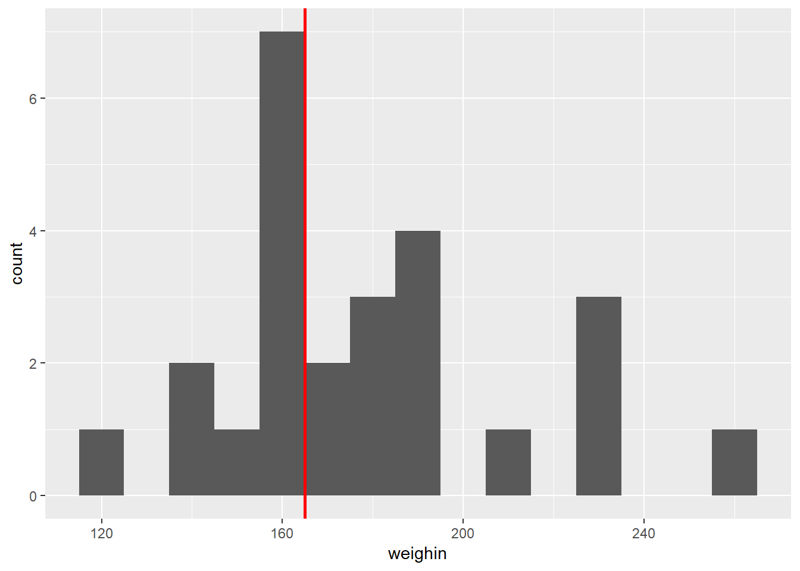
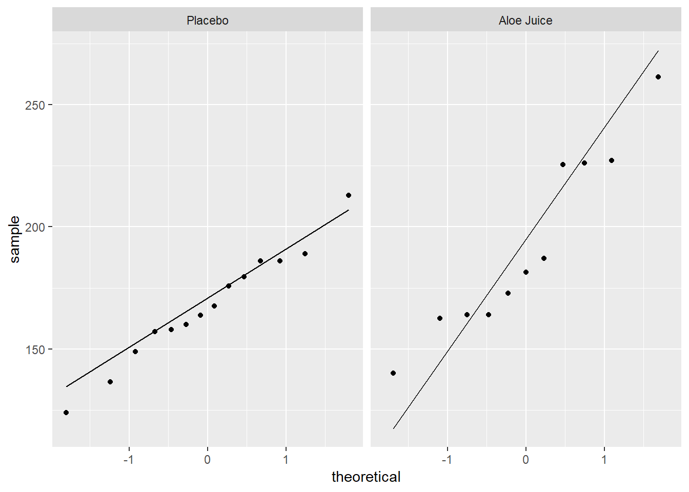

# ONE SAMPLE t-TEST: for the MEAN


## Background

### Required Packages 


```r
library(tidyverse)    # Loads several very helpful 'tidy' packages
library(haven)        # Read in SPSS datasets
```


### Example Dataset - Cancer Experiment 

#### Source of Data {-}

Mid-Michigan Medical Center, Midland, Michigan, 1999: A  study of oral condition of cancer patients.

#### Description of the Study {-}

The data set contains part of the data for a study of oral condition of cancer patients conducted at the Mid-Michigan Medical Center.  The oral conditions of the patients were measured and recorded at the initial stage, at the end of the second week, at the end of the fourth week, and at the end of the sixth week.  The variables age, initial weight and initial cancer stage of the patients were recorded.  Patients were divided into two groups at random:  One group received a placebo and the other group received aloe juice treatment.

Sample size $n = 25$ patients with neck cancer. The treatment is **Aloe Juice**. 

#### Variables Included {-}

* `ID` patient identification number

* `trt` treatment group 
    + `0` *placebo* 
    + `1` *aloe juice*

* `age` patient's age, *in years*

* `weightin` patient's weight *(pounds)* at the initial stage

* `stage`	initial cancer stage
    + coded `1` through `4`

* `totalcin` oral condition at the *initial stage*
* `totalcw2` oral condition at the end of *week 2*
* `totalcw4` oral condition at the end of *week 4*
* `totalcw6` oral condition at the end of *week 6*


```r
cancer_raw <- haven::read_spss("https://raw.githubusercontent.com/CEHS-research/eBook_ANOVA/master/data/Cancer.sav")

tibble::glimpse(cancer_raw)
```

```
Observations: 25
Variables: 9
$ ID       <dbl> 1, 5, 6, 9, 11, 15, 21, 26, 31, 35, 39, 41, 45, 2, 12...
$ TRT      <dbl> 0, 0, 0, 0, 0, 0, 0, 0, 0, 0, 0, 0, 0, 0, 1, 1, 1, 1,...
$ AGE      <dbl> 52, 77, 60, 61, 59, 69, 67, 56, 61, 51, 46, 65, 67, 4...
$ WEIGHIN  <dbl> 124.0, 160.0, 136.5, 179.6, 175.8, 167.6, 186.0, 158....
$ STAGE    <dbl> 2, 1, 4, 1, 2, 1, 1, 3, 1, 1, 4, 1, 1, 2, 4, 1, 2, 1,...
$ TOTALCIN <dbl> 6, 9, 7, 6, 6, 6, 6, 6, 6, 6, 7, 6, 8, 7, 6, 4, 6, 6,...
$ TOTALCW2 <dbl> 6, 6, 9, 7, 7, 6, 11, 11, 9, 4, 8, 6, 8, 16, 10, 6, 1...
$ TOTALCW4 <dbl> 6, 10, 17, 9, 16, 6, 11, 15, 6, 8, 11, 9, 9, 9, 11, 8...
$ TOTALCW6 <dbl> 7, 9, 19, 3, 13, 11, 10, 15, 8, 7, 11, 6, 10, 10, 9, ...
```


```r
cancer_clean <- cancer_raw %>% 
  dplyr::rename_all(tolower) %>% 
  dplyr::mutate(id = factor(id)) %>% 
  dplyr::mutate(trt = factor(trt,
                             labels = c("Placebo", 
                                        "Aloe Juice"))) %>% 
  dplyr::mutate(stage = factor(stage))

tibble::glimpse(cancer_clean)
```

```
Observations: 25
Variables: 9
$ id       <fct> 1, 5, 6, 9, 11, 15, 21, 26, 31, 35, 39, 41, 45, 2, 12...
$ trt      <fct> Placebo, Placebo, Placebo, Placebo, Placebo, Placebo,...
$ age      <dbl> 52, 77, 60, 61, 59, 69, 67, 56, 61, 51, 46, 65, 67, 4...
$ weighin  <dbl> 124.0, 160.0, 136.5, 179.6, 175.8, 167.6, 186.0, 158....
$ stage    <fct> 2, 1, 4, 1, 2, 1, 1, 3, 1, 1, 4, 1, 1, 2, 4, 1, 2, 1,...
$ totalcin <dbl> 6, 9, 7, 6, 6, 6, 6, 6, 6, 6, 7, 6, 8, 7, 6, 4, 6, 6,...
$ totalcw2 <dbl> 6, 6, 9, 7, 7, 6, 11, 11, 9, 4, 8, 6, 8, 16, 10, 6, 1...
$ totalcw4 <dbl> 6, 10, 17, 9, 16, 6, 11, 15, 6, 8, 11, 9, 9, 9, 11, 8...
$ totalcw6 <dbl> 7, 9, 19, 3, 13, 11, 10, 15, 8, 7, 11, 6, 10, 10, 9, ...
```


```r
psych::headTail(cancer_clean)
```

```
    id        trt age weighin stage totalcin totalcw2 totalcw4 totalcw6
1    1    Placebo  52     124     2        6        6        6        7
2    5    Placebo  77     160     1        9        6       10        9
3    6    Placebo  60   136.5     4        7        9       17       19
4    9    Placebo  61   179.6     1        6        7        9        3
5 <NA>       <NA> ...     ...  <NA>      ...      ...      ...      ...
6   42 Aloe Juice  73   181.5     0        8       11       16     <NA>
7   44 Aloe Juice  67     187     1        5        7        7        7
8   50 Aloe Juice  60     164     2        6        8       16     <NA>
9   58 Aloe Juice  54   172.8     4        7        8       10        8
```


## Exploratory Data Analysis: i.e. the eyeball method

**Is the baseline weight more than 165 pounds?**


### Mean and SD


```r
cancer_clean %>% 
  furniture::table1(weighin,
                    na.rm = FALSE)
```

```

---------------------------
         Mean/Count (SD/%)
         n = 25           
 weighin                  
         178.3 (32.0)     
---------------------------
```


```r
32 / sqrt(25)
```

```
[1] 6.4
```

> Since the stadard deviation ($s_X$) is 32.0, the standard error for the mean (SEM = SE = $s_{\overline{X}}$) is 6.4.  So even though the observed average of 178.3 is a higher number than 165, it may or may not we statistically significant.


### Histogram


```r
cancer_clean %>% 
  ggplot(aes(weighin)) +
  geom_histogram(binwidth = 10) +
  geom_vline(xintercept = 165, color = "red", size = 1)  # Add a thick red line at 165 pounds
```




## Assumptions

### Random Sampling

The Sample was drawn at random (at least as representative as possible)

* Nothing can be done to fix NON-representative samples!     
* Can not for with any statistically test


### Normality

> A variable is said to follow the normal distribution if it resembles the normal curve.  Specifically it is symetrical, unimodal, and bell shaped.

The continuous variable has a **NORMAL** distribution in BOTH populations

* Not as important if the sample is large *(Central Limit Theorem)*
* IF the sample is far from normal &/or small, might want to use a different method  

**Options to judging normality:**

1. Visualization of each sample's distribution    
    + Stacked **histograms**, but is sensitive to binning choices *(number or width)*
    + Side-by-side **boxplots**, shows *median* instead of *mean* as central line
    + Seperate **QQ plots** (straight $45^\circ$ line), but is sensitive to outliers!    
    
2. Calculate **Skewness** and **Kurtosis** 
    + Divided each value by its standard error (SE)    
    + A result $\gt \pm 2$ indicates issues  

3. Formal Inferencial Tests for Normality  
    + Null-hypothesis: population is normally distributed
    + A $p \lt .05$ ???indicate snon-normality
    + For smaller samples, use **Shapiro-Wilk's Test** 
    + For larger samples, use **Kolmogorov-Smirnov's Test**


```r
cancer_clean %>% 
  ggplot(aes(sample = weighin)) +    # make sure to include "sample = "
  geom_qq() +                        # layer on the dots
  stat_qq_line() +                   # layer on the line
  facet_grid(. ~ trt)                # panel by group
```




```r
cancer_clean %>% 
  dplyr::pull(weighin) %>%                 # extract the continuous variable
  shapiro.test()                            # test for normality
```

```

	Shapiro-Wilk normality test

data:  .
W = 0.93899, p-value = 0.1403
```


> Shapiro-Wilk's tests yielded no evidence that weight is not normaly distributed at baseline, $W = .939, p = .140$,.  


## Inference

**Formal Statistical Test: t-Test for Difference in Independent Group Means**

<div class="rmdlightbulb">
<p>Use the <code>t.test()</code> funtion for a single sample.</p>
<p><strong>Before you can run the t Test, you must seperate out or 'PULL' your variable out of the dataset.</strong></p>
<p>Use the <code>dplyr::pull(continuous_variable)</code>step befor running the t Test</p>
<p><strong>Inside the funtion you need to specify one option:</strong></p>
<ul>
<li>the null-hypothesis value: <code>mu = ##</code> (replace with your number)</li>
</ul>
<p><strong>You MAY need/want to specify some or all of the following options you may way to leave as the default or override:</strong></p>
<ul>
<li>Number of tails:
<ul>
<li><code>alternative = &quot;two.sided&quot;</code> <strong>Default</strong> Allows for a 2-sided alternative</li>
<li><code>alternative = &quot;less&quot;</code> Only Allows: group 1 &lt; group 2</li>
<li><code>alternative = &quot;greater&quot;</code> Only Allows: group 1 &gt; group 2</li>
</ul></li>
<li>Confidence level:
<ul>
<li><code>conf.level = 0.95</code> <strong>Default</strong> Computes the 95% confidence inverval<br />
</li>
<li><code>conf.level = 0.90</code> Changes to a 90% confidence interval</li>
</ul></li>
</ul>
</div>


### All Defaults


```r
cancer_clean %>% 
  dplyr::pull(weighin) %>%    # pull the continuous varaible out
  t.test(mu = 165)            # specify the null hypothesis value
```

```

	One Sample t-test

data:  .
t = 2.0765, df = 24, p-value = 0.04872
alternative hypothesis: true mean is not equal to 165
95 percent confidence interval:
 165.0807 191.4793
sample estimates:
mean of x 
   178.28 
```

> There is evidence that cancer patients weight more (N = 25, M = 178.28) now than the historic average of 165 pound, $t(24) = 2.077, p = .049, 95% CI: 165.08, 191.48$.


### Confidence Level other than 95%

**Find a 99% confience level for the population mean weight.**


```r
cancer_clean %>% 
  dplyr::pull(weighin) %>%    # pull the continuous varaible out
  t.test(mu = 165,            # specify the null hypothesis value
         conf.level = 0.99)   # over-ride the default of 95% CI
```

```

	One Sample t-test

data:  .
t = 2.0765, df = 24, p-value = 0.04872
alternative hypothesis: true mean is not equal to 165
99 percent confidence interval:
 160.3927 196.1673
sample estimates:
mean of x 
   178.28 
```

> There is evidence that cancer patients weight more (N = 25, M = 178.28) now than the historic average of 165 pound, $t(24) = 2.077, p = .049, 99% CI: 160.39, 196.17$.

### One-Sided Test, instead of Two

**Find a 99% confience level for the population mean weight.**


```r
cancer_clean %>% 
  dplyr::pull(weighin) %>%          # pull the continuous varaible out
  t.test(mu = 165,                  # specify the null hypothesis value
         alternative = "greater")   # over-ride the default of 95% CI
```

```

	One Sample t-test

data:  .
t = 2.0765, df = 24, p-value = 0.02436
alternative hypothesis: true mean is greater than 165
95 percent confidence interval:
 167.3384      Inf
sample estimates:
mean of x 
   178.28 
```

> There is evidence that cancer patients weight more (N = 25, M = 178.28) now than the historic average of 165 pound, $t(24) = 2.077, p = .024$.  


### Restrict to a Subsample

**Do the patients with *stage 3 and 4* cancer weigh more than 165 pounds at intake, on average?**


```r
cancer_clean %>% 
  dplyr::filter(stage %in% c("3", "4")) %>%    # select a sub-sample 
  dplyr::pull(weighin) %>%                     # pull the continuous varaible out
  t.test(mu = 165)                             # specify the null hypothesis value
```

```

	One Sample t-test

data:  .
t = 0.82627, df = 5, p-value = 0.4463
alternative hypothesis: true mean is not equal to 165
95 percent confidence interval:
 137.0283 219.4717
sample estimates:
mean of x 
   178.25 
```

> There is NO evidence that stage three and four cancer (n = 6, M = 178.25) patients weight more now than the historic average of 165 pound, $t(24) = 0.826, p = .446$.  

