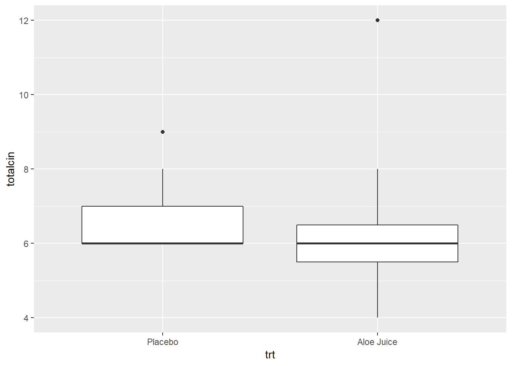

# t TEST FOR THE DIFFERENCE IN 2 MEANS, INDEPENDENT SAMPLES 


## Required Packages 


```r
library(tidyverse)    # Loads several very helpful 'tidy' packages
library(haven)        # Read in SPSS datasets
library(car)          # Companion for Applied Regression (and ANOVA)
```


## Example Dataset - Cancer Experiment 

The `Cancer` dataset was introduced in "t TEST FOR THE MEAN OF 1 SAMPLE".


## Check Means and SD’s


```r
cancer_clean %>% 
  dplyr::group_by(trt) %>% 
  furniture::table1(totalcin, totalcw4)
```

```

--------------------------------
                 trt 
          Placebo    Aloe Juice
          n = 14     n = 11    
 totalcin                      
          6.6 (0.9)  6.5 (2.1) 
 totalcw4                      
          10.1 (3.6) 10.6 (3.5)
--------------------------------
```


-------------------------------------------------------

## Assumtion Check

### Eyeball method

Do the two groups, treatment and control, have the same amount of spread (standard deviations) BUT different centers (means)?


```r
cancer_clean %>% 
  ggplot(aes(x = trt,
             y = totalcin)) +
  geom_boxplot()
```




```r
cancer_clean %>% 
  ggplot(aes(x = trt,
             y = totalcw4)) +
  geom_boxplot()
```


-------------------------------------------------------

###Homogeneity of Variance (HOV) Formal Test

Before performing the $t$ test, check to see if the assumption of homogeneity of variance is met using **Levene's Test**.  For a independent samples `t`-test for means, the groups need to have the same amount of spread (SD) in the measure of interest.

Use the `car:leveneTest()` function to do this.  Inside the funtion you need to specify at least three things (sepearated by commas):

- the formula:  `continuous_var ~ grouping_var` (replace with your variable names)
- the dataset:  `data = .` to pipe it from above
- the center:   `center = "mean"` since we are comparing means

> Do the participants in the treatment and control groups have the same spread in oral condition at BASELINE?


```r
cancer_clean %>% 
  car::leveneTest(totalcin ~ trt,    # formula: continuous_var ~ grouping_var
                  data = .,          # pipe in the dataset
                  center = "mean")   # The default is "median"
```

```
Levene's Test for Homogeneity of Variance (center = "mean")
      Df F value Pr(>F)
group  1  2.2103 0.1507
      23               
```

No violations of homogeneity were detected, $F(1, 23) = 2.210, p = .151$.


> Do the participants in the treatment and control groups have the same spread in oral condition at the FOURTH WEEK?


```r
cancer_clean %>% 
  car::leveneTest(totalcw4 ~ trt,    # formula: continuous_var ~ grouping_var
                  data = .,          # pipe in the dataset
                  center = "mean")   # The default is "median"
```

```
Levene's Test for Homogeneity of Variance (center = "mean")
      Df F value Pr(>F)
group  1       0  0.995
      23               
```


No violations of homogeneity were detected, $F(1, 23) = 0, p = .995$.


-------------------------------------------------------


## 2 independent Sample Means

Use the same `t.test()` funtion we have used in the prior chapters.  This time you need to speficy a few more options.
 
  

* the formula:  `continuous_var ~ grouping_var` (replace with your variable names)

* the dataset:  `data = .` to pipe it from above

* is homogeneity satified?: `var.equal = TRUE` (**NOT the default**)

* number of tails: `alternative = "two.sided"` 

* independent vs. paired:  `paired = FALSE` 

* confidence level: `conf.level = #` 


> Do the participants in the treatment group have a different average oral condition at BASELINE, compared to the control group?


```r
# Minimal syntax
cancer_clean %>% 
  t.test(totalcin ~ trt,   # formula: continuous_var ~ grouping_var
         data = .,         # pipe in the dataset
         var.equal = TRUE) # HOV was violated (option = TRUE)
```

```

	Two Sample t-test

data:  totalcin by trt
t = 0.18566, df = 23, p-value = 0.8543
alternative hypothesis: true difference in means is not equal to 0
95 percent confidence interval:
 -1.185479  1.419245
sample estimates:
   mean in group Placebo mean in group Aloe Juice 
                6.571429                 6.454545 
```

No evidence of a differnece in mean oral condition at baseline, $t(23) = 0.186, p = .854$.


> Do the participants in the treatment group have a different average oral condition at the FOURTH WEEK, compared to the control group?


```r
# Fully specified function
cancer_clean %>% 
  t.test(totalcw4 ~ trt,             # formula: continuous_var ~ grouping_var
         data = .,                   # pipe in the dataset
         var.equal = TRUE,           # default: HOV was violated (option = TRUE)
         alternative = "two.sided",  # default: 2 sided (options = "less", "greater")
         paired = FALSE,             # default: independent (option = TRUE)
         conf.level = .95)           # default: 95% (option = .9, .90, ect.)
```

```

	Two Sample t-test

data:  totalcw4 by trt
t = -0.34598, df = 23, p-value = 0.7325
alternative hypothesis: true difference in means is not equal to 0
95 percent confidence interval:
 -3.444215  2.457202
sample estimates:
   mean in group Placebo mean in group Aloe Juice 
                10.14286                 10.63636 
```

No evidence of a differnece in mean oral condition at the fourth week, $t(23) = -0.350, p = .733$.


