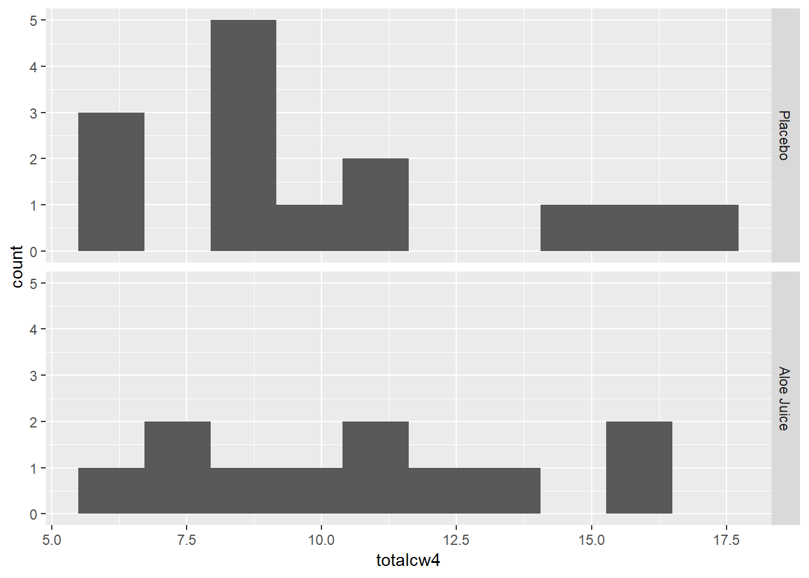
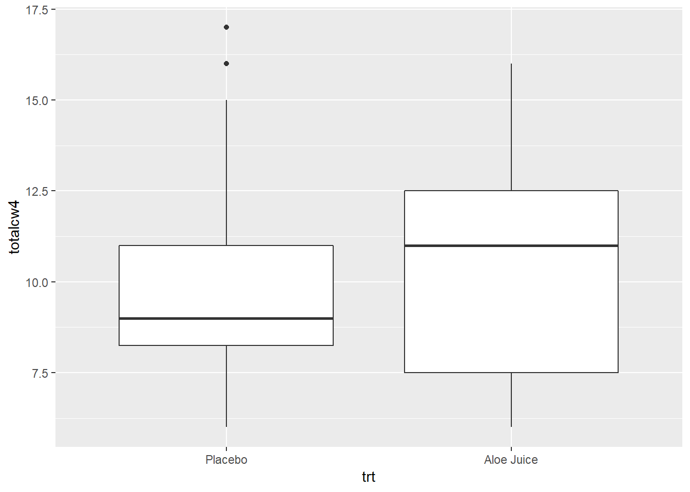

# t TEST FOR THE DIFFERENCE IN 2 MEANS, INDEPENDENT SAMPLES 


## Required Packages 


```r
library(tidyverse)    # Loads several very helpful 'tidy' packages
library(haven)        # Read in SPSS datasets
library(car)          # Companion for Applied Regression (and ANOVA)
```


## Example Dataset - Cancer Experiment 

The `Cancer` dataset was introduced in "t TEST FOR THE MEAN OF 1 SAMPLE".


```r
cancer_raw <- haven::read_spss("https://raw.githubusercontent.com/CEHS-research/eBook_ANOVA/master/data/Cancer.sav")

tibble::glimpse(cancer_raw)
```

```
Observations: 25
Variables: 9
$ ID       <dbl> 1, 5, 6, 9, 11, 15, 21, 26, 31, 35, 39, 41, 45, 2, 12...
$ TRT      <dbl> 0, 0, 0, 0, 0, 0, 0, 0, 0, 0, 0, 0, 0, 0, 1, 1, 1, 1,...
$ AGE      <dbl> 52, 77, 60, 61, 59, 69, 67, 56, 61, 51, 46, 65, 67, 4...
$ WEIGHIN  <dbl> 124.0, 160.0, 136.5, 179.6, 175.8, 167.6, 186.0, 158....
$ STAGE    <dbl> 2, 1, 4, 1, 2, 1, 1, 3, 1, 1, 4, 1, 1, 2, 4, 1, 2, 1,...
$ TOTALCIN <dbl> 6, 9, 7, 6, 6, 6, 6, 6, 6, 6, 7, 6, 8, 7, 6, 4, 6, 6,...
$ TOTALCW2 <dbl> 6, 6, 9, 7, 7, 6, 11, 11, 9, 4, 8, 6, 8, 16, 10, 6, 1...
$ TOTALCW4 <dbl> 6, 10, 17, 9, 16, 6, 11, 15, 6, 8, 11, 9, 9, 9, 11, 8...
$ TOTALCW6 <dbl> 7, 9, 19, 3, 13, 11, 10, 15, 8, 7, 11, 6, 10, 10, 9, ...
```


```r
cancer_clean <- cancer_raw %>% 
  dplyr::rename_all(tolower) %>% 
  dplyr::mutate(id = factor(id)) %>% 
  dplyr::mutate(trt = factor(trt,
                             labels = c("Placebo", 
                                        "Aloe Juice"))) %>% 
  dplyr::mutate(stage = factor(stage))

tibble::glimpse(cancer_clean)
```

```
Observations: 25
Variables: 9
$ id       <fct> 1, 5, 6, 9, 11, 15, 21, 26, 31, 35, 39, 41, 45, 2, 12...
$ trt      <fct> Placebo, Placebo, Placebo, Placebo, Placebo, Placebo,...
$ age      <dbl> 52, 77, 60, 61, 59, 69, 67, 56, 61, 51, 46, 65, 67, 4...
$ weighin  <dbl> 124.0, 160.0, 136.5, 179.6, 175.8, 167.6, 186.0, 158....
$ stage    <fct> 2, 1, 4, 1, 2, 1, 1, 3, 1, 1, 4, 1, 1, 2, 4, 1, 2, 1,...
$ totalcin <dbl> 6, 9, 7, 6, 6, 6, 6, 6, 6, 6, 7, 6, 8, 7, 6, 4, 6, 6,...
$ totalcw2 <dbl> 6, 6, 9, 7, 7, 6, 11, 11, 9, 4, 8, 6, 8, 16, 10, 6, 1...
$ totalcw4 <dbl> 6, 10, 17, 9, 16, 6, 11, 15, 6, 8, 11, 9, 9, 9, 11, 8...
$ totalcw6 <dbl> 7, 9, 19, 3, 13, 11, 10, 15, 8, 7, 11, 6, 10, 10, 9, ...
```


```r
psych::headTail(cancer_clean)
```

```
    id        trt age weighin stage totalcin totalcw2 totalcw4 totalcw6
1    1    Placebo  52     124     2        6        6        6        7
2    5    Placebo  77     160     1        9        6       10        9
3    6    Placebo  60   136.5     4        7        9       17       19
4    9    Placebo  61   179.6     1        6        7        9        3
5 <NA>       <NA> ...     ...  <NA>      ...      ...      ...      ...
6   42 Aloe Juice  73   181.5     0        8       11       16     <NA>
7   44 Aloe Juice  67     187     1        5        7        7        7
8   50 Aloe Juice  60     164     2        6        8       16     <NA>
9   58 Aloe Juice  54   172.8     4        7        8       10        8
```


## Eyeball method

**Do the two groups, treatment and control, have different oral conditions at initial observation?**

Judge any difference in centers (means) within the context of the  within  group spread (stadard deviation/variance)


### Means and SDs


```r
cancer_clean %>% 
  dplyr::group_by(trt) %>% 
  furniture::table1(totalcin, totalcw4,
                    na.rm = FALSE)
```

```

--------------------------------
                 trt 
          Placebo    Aloe Juice
          n = 14     n = 11    
 totalcin                      
          6.6 (0.9)  6.5 (2.1) 
 totalcw4                      
          10.1 (3.6) 10.6 (3.5)
--------------------------------
```


### Stacked Histograms

#### Baseline Oral Condition


```r
cancer_clean %>% 
  ggplot(aes(totalcin)) +
  geom_histogram(bins = 10) +
  facet_grid(trt ~ .)
```


#### Four Weeks Oral Condition


```r
cancer_clean %>% 
  ggplot(aes(totalcw4)) +
  geom_histogram(bins = 10) +
  facet_grid(trt ~ .)
```




### Side-by-Side Boxplots

#### Baseline Oral Condition


```r
cancer_clean %>% 
  ggplot(aes(x = trt,
             y = totalcin)) +
  geom_boxplot()
```


#### Four Weeks Oral Condition


```r
cancer_clean %>% 
  ggplot(aes(x = trt,
             y = totalcw4)) +
  geom_boxplot()
```



## Formal Statistical Test

### Assumption (1): Two Samples are Indepdented, Simple-Random Samples

Can not check statistically.  Can only ensure through good sampling.


### Assumption (2): Two Populations are Normaly Distributed

The first assumption to check is if the continuous variable of interest (dependent variable, DV, or outcome) is NORMALLY approximately distributed within each sample.  This is best done visually with a histogram (above) or a  quantile-quantile plot (below).  On the QQ plot, a normally distributed sample will have all the data points along a straight diagnoal line.  

#### Baseline Oral Condition


```r
cancer_clean %>% 
  ggplot(aes(sample = totalcin)) +
  geom_qq() +
  stat_qq_line() +
  facet_grid(. ~ trt)
```


#### Four Weeks Oral Condition


```r
cancer_clean %>% 
  ggplot(aes(sample = totalcw4)) +
  geom_qq() +
  stat_qq_line() +
  facet_grid(. ~ trt)
```


### Assumption (2): Two Populations exhibit Homogeneity of Variance (HOV)

Before performing the $t$ test, check to see if the assumption of homogeneity of variance is met using **Levene's Test**.  For a independent samples `t`-test for means, the groups need to have the same amount of spread (SD) in the measure of interest.

<div class="rmdlightbulb">
<p>Use the <code>car:leveneTest()</code> function tests the HOV assumtion.</p>
<p>Inside the funtion you need to specify at least three options (sepearated by commas):</p>
<ul>
<li>the formula: <code>continuous_var ~ grouping_var</code> (replace with your variable names)</li>
<li>the dataset: <code>data = .</code> to pipe it from above</li>
<li>the center: <code>center = &quot;mean&quot;</code> since we are comparing means</li>
</ul>
</div>


#### Baseline Oral Condition

Do the participants in the treatment and control groups have the same spread in oral condition at BASELINE?


```r
cancer_clean %>% 
  car::leveneTest(totalcin ~ trt,    # formula: continuous_var ~ grouping_var
                  data = .,          # pipe in the dataset
                  center = "mean")   # The default is "median"
```

```
Levene's Test for Homogeneity of Variance (center = "mean")
      Df F value Pr(>F)
group  1  2.2103 0.1507
      23               
```

> No violations of homogeneity were detected, $F(1, 23) = 2.210, p = .151$.


#### Four Weeks Oral Condition

Do the participants in the treatment and control groups have the same spread in oral condition at the FOURTH WEEK?


```r
cancer_clean %>% 
  car::leveneTest(totalcw4 ~ trt,    # formula: continuous_var ~ grouping_var
                  data = .,          # pipe in the dataset
                  center = "mean")   # The default is "median"
```

```
Levene's Test for Homogeneity of Variance (center = "mean")
      Df F value Pr(>F)
group  1       0  0.995
      23               
```

> No violations of homogeneity were detected, $F(1, 23) = 0, p = .995$.


### t-Test for Difference in Means

<div class="rmdlightbulb">
<p>Use the same <code>t.test()</code> funtion we have used for a single sample, but speficy a few more options.</p>
<p><strong>Inside the funtion you need to specify at least three options (sepearated by commas):</strong></p>
<ul>
<li>the formula: <code>continuous_var ~ grouping_var</code> (replace with your variable names)<br />
</li>
<li>the dataset: <code>data = .</code> to pipe it from above</li>
</ul>
<p><strong>You MAY need/want to specify some or all of the following options you may way to leave as the default or override:</strong></p>
<ul>
<li>HOV assumed:
<ul>
<li><code>var.equal = FALSE</code> <strong>Default</strong> Seperate-Variance test using Welch's df<br />
</li>
<li><code>var.equal = TRUE</code> Pooled-Variance test <em>(if HOV is NOT violated)</em></li>
</ul></li>
<li>Number of tails:
<ul>
<li><code>alternative = &quot;two.sided&quot;</code> <strong>Default</strong> Allows for a 2-sided alternative</li>
<li><code>alternative = &quot;less&quot;</code> Only Allows <span class="math inline">\(H_0: \mu_1 - \mu_2 &lt; 0\)</span></li>
<li><code>alternative = &quot;more</code> Only Allows <span class="math inline">\(H_0: \mu_1 - \mu_2 &gt; 0\)</span></li>
</ul></li>
<li>Independent vs. paired:
<ul>
<li><code>paired = FALSE</code> <strong>Default</strong> Conducts an INDEOENDENT groups t-Test<br />
</li>
<li><code>paired = TRUE</code> Conducts a PAIRED meausres t-Test</li>
</ul></li>
<li>Confidence level:
<ul>
<li><code>conf.level = 0.95</code> <strong>Default</strong> Computes the 95% confidence inverval<br />
</li>
<li><code>conf.level = 0.90</code> Changes to a 90% confidence interval</li>
</ul></li>
</ul>
</div>


#### Baseline Oral Condition

Do the participants in the treatment group have a different average oral condition at BASELINE, compared to the control group?


```r
# Minimal syntax
cancer_clean %>% 
  t.test(totalcin ~ trt,   # formula: continuous_var ~ grouping_var
         data = .,         # pipe in the dataset
         var.equal = TRUE) # HOV was violated (option = TRUE)
```

```

	Two Sample t-test

data:  totalcin by trt
t = 0.18566, df = 23, p-value = 0.8543
alternative hypothesis: true difference in means is not equal to 0
95 percent confidence interval:
 -1.185479  1.419245
sample estimates:
   mean in group Placebo mean in group Aloe Juice 
                6.571429                 6.454545 
```

> No evidence of a differnece in mean oral condition at baseline, $t(23) = 0.186, p = .854$.


#### Four Weeks Oral Condition


Do the participants in the treatment group have a different average oral condition at the FOURTH WEEK, compared to the control group?


```r
# Fully specified function
cancer_clean %>% 
  t.test(totalcw4 ~ trt,             # formula: continuous_var ~ grouping_var
         data = .,                   # pipe in the dataset
         var.equal = TRUE,           # default: HOV was violated (option = TRUE)
         alternative = "two.sided",  # default: 2 sided (options = "less", "greater")
         paired = FALSE,             # default: independent (option = TRUE)
         conf.level = .95)           # default: 95% (option = .9, .90, ect.)
```

```

	Two Sample t-test

data:  totalcw4 by trt
t = -0.34598, df = 23, p-value = 0.7325
alternative hypothesis: true difference in means is not equal to 0
95 percent confidence interval:
 -3.444215  2.457202
sample estimates:
   mean in group Placebo mean in group Aloe Juice 
                10.14286                 10.63636 
```

> No evidence of a differnece in mean oral condition at the fourth week, $t(23) = -0.350, p = .733$.


