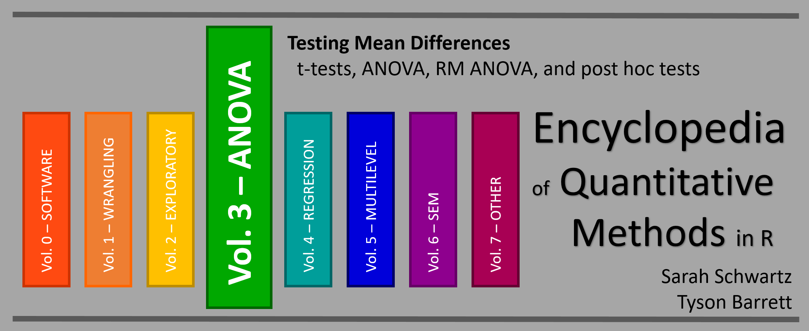

--- 
title: "Encyclopedia of Quantitative Methods in R, vol. 3: Testing Mean Differences"
author: "Sarah Schwartz & Tyson Barrett"
date: "Last updated: `r Sys.Date()`"
documentclass: book
description: "t-tests, ANOVA, RM ANOVA, and post hoc tests."
knit: "bookdown::render_book"
cover-image: "EQM_v1_cover.png"
github-repo: cehs-research/eBook_wrangle
site: bookdown::bookdown_site
bibliography: [book.bib, packages.bib]
biblio-style: "apalike"
link-citations: yes
---

  


# Welcome {-}

Backgroup and links to other volumes of this encyclopedia may be found at the [Encyclopedia's Home Website](https://cehs-research.github.io/eBooks/).




```{r global_options, include=FALSE}
# set global chunk options...  
#  this changes the defaults so you don't have to repeat yourself
knitr::opts_chunk$set(comment     = NA,
                      cache       = TRUE,
                      echo        = TRUE, 
                      warning     = FALSE, 
                      message     = FALSE,
                      out.width   = "75%")
```


```{r, echo=FALSE, include=FALSE, comment=FALSE, message=FALSE}
library(tidyverse, quietly = TRUE)
library(kableExtra)
```


## Blocked Notes {-}

Thoughout all the eBooks in this encyclopedia, several small secitons will be blocked out in the following ways:

```{block type='rmdconstruct', echo=TRUE}
These blocks denote an area **UNDER CONSTRUCTION**, so check back often.  This massive undertaking started during the summer of 2018 and is far from complete.  The outline of seven volumes is given above despite any one being complete.  Feedback is welcome via either author's email.
```


```{block type='rmdimportant', echo=TRUE}
These blocks denote something **EXTREMELY IMPORTANT**.  Do NOT skip these notes as they will be used very sparingly.
```


```{block type='rmddownload', echo=TRUE}
These blocks denote something to **DOWNLOAD**.  This may include software installations, example datasets, or notebook code files.
```


```{block type='rmdlightbulb', echo=TRUE}
These blocks denote something **INTERESTING**.  These point out information we found of interest or added value.
```


```{block type='rmdlink', echo=TRUE}
These blocks denote **LINKS** to other websites.  This may include instructional video clips, articles, or blog posts.  We are all about NOT re-creating the wheel.  If somebody else has described or illustrated a topic well, we celebrate it!
```


## Code and Output {-}

This is how $R$ code is shown:

```{r, eval=FALSE}
1 + 1
```

This is what the output of the $R$ code above will look:

```{r, echo=FALSE}
# This is a Code Chunk
1 + 1
```


## The Authors {-}


```{r, echo=FALSE}
tribble( ~Sarah, ~Tyson,
      "{width=300px}",
      "{width=300px}",
      "[www.SarahSchwartzStats.com](http://www.sarahschwartzstats.com/) ",
      "[www.TysonBarrett.com](http://tysonbarrett.com/)",
      "Sarah.Schwartz@usu.edu",
      "Tyson.Barrett@usu.edu",
      "[Statistical Consulting Studio](https://cehs.usu.edu/research/statstudio/index)",
      "[Data Science and Discover Unit](https://cehs.usu.edu/research/dsdu/index)",
      "{width=300px}",
      "{width=300px}") %>% 
  data.frame() %>%
  kableExtra::kable(col.names = c("Dr. Sarah Schwartz", 
                                  "Dr. Tyson Barrett"),
                    align = "c") %>% 
  kableExtra::row_spec(row = 0,
                       font_size = 20)
```


### Why choose R ?  {-}


```{block type='rmdlink', echo=TRUE}
**Check it out:** an article from Fall 2016... [No more excuses: R is better than SPSS for psychology undergrads, and students agree](https://datahowler.wordpress.com/2016/09/10/no-more-excuses-r-is-better-than-spss-for-psychology-undergrads-and-students-agree/)
```


### FYI  {-}

This entire encyclopedia is written in $R Markdown$, using $R Studio$ as the text editor and the `bookdown` package to turn a collection of markdown documents into a coherent whole. The book's source code is hosted on GitHub. If you notice typos or other issues, feel free to email either of the authors.

This work is licensed under the [Attribution-NonCommercial-NoDerivatives 4.0 International](https://creativecommons.org/licenses/by-nc-nd/4.0/legalcode) License. 


{width=300px}

<!--chapter:end:index.Rmd-->

# Intro: Ihno's Experiemnt

```{r, include=FALSE}
knitr::opts_chunk$set(comment     = "",
                      echo        = TRUE, 
                      warning     = FALSE, 
                      message     = FALSE,
                      fig.align   = "center", # center all figures
                      fig.width   = 6,        # set default figure width to 4 inches
                      fig.height  = 4)        # set default figure height to 3 inches
```


```{r, message=FALSE, error=FALSE}
library(tidyverse)       # super helpful everything!
library(haven)           # inporting SPSS, SAS, & Stata data files
library(psych)           # lots of nice tidbits 
```


## Background of Data

```{block type='rmdlink', echo=TRUE}
@epse4: has made the data from his textbook "Explaining Spychological Statistics, 4th edition" available on his [website](http://www.psych.nyu.edu/cohen/EPS4e.html )
```


 The data come from a *hypothetical* study performed by **Ihno** *(pronounced “Eee-know”)*, an advanced doctoral student, who was the teaching assistant (TA) for several sections of a statistics course. The **100 participants** in the data set are the students who were enrolled in Ihno’s sections, and voluntarily consented to be in her study, which was approved by the appropriate review board at her hypothetical school. Her data were collected on two different days. On the first day of classes, the students who came to one of Ihno’s sections filled in a brief **background questionnaire** on which they provided contact information, some qualitative data (`gender`, undergrad `major`, why they had enrolled in statistics (`reason`), and whether they have a habit of drinking `coffee`), and some quantitative data (number of math courses already completed (`prevmath`), the score they received on a diagnostic math background quiz they were all required to take before registering for statistics `mathquiz`, and a rating of their math `phobia` on a scale from 0 to 10). You will see that, due to late registration and other factors, not all of Ihno’s students took the diagnostic math background quiz.

 The rest of Ihno’s data were collected as part of an **experiment** that she conducted during her recitation sessions on one day in the middle of the semester. (The one exception is that her students took a regular 10 question quiz the week before her experiment (`statquiz`), and she decided to add those scores to her data set.) At the beginning of the experiment, Ihno explained how each student could take his or her own pulse. She then provided a half-minute interval during which they counted the number of beats, and then wrote down twice that number as their heart rate (`hr_base`) in beats per minute (bpm). Then, each student reported how many cups of coffee they had consumed since waking up that morning (`num_cups`), and filled out an anxiety questionnaire consisting of 10 items, each rated (0 to 4) on a 5-point Likertscale. Total scores could range from 0 to 40, and provided a measure of baseline anxiety (`anx_base`). 

 Next, Ihno announced a pop quiz. She handed out a page containing 11 multiple-choice statistics questions on material covered during the preceding two weeks, and asked the students to keep this page face down while taking and recording their  pulse (`hr_pre`) and filling out a anxiety questionnaire (`anx_pre`). Then Ihno told the students they had 15 minutes to take the fairly difficult quiz. She also told them that the first 10 questions were worth 1 point each but that the 11th question was worth 3 points of extra credit. Ihno’s experimental manipulation consisted of varying the difficulty of the 11th question. Twenty-five quizzes were distributed at each level of difficulty of the final question: easy, moderate, difficult, and impossible to solve (`exp_cond`). After the quizzes were collected, Ihno asked the students to provide heart rate and anxiety data one more time (`hr_post`, `anx_post`). Finally, Ihno explained the experiment, adding that the 11th quiz question would not be scored and that, although the students would get back their quizzes with their score for the first 10 items (`statquiz`), that score would not influence their grade for the statistics course.
 
 
```{block type='rmdlightbulb', echo=TRUE}
You can use a file's **link** to read data directly off a website
```


## Import & Wrangle the Data

The `Cancer` dataset is saved in SPSS format, which is evident from the `.sav` ending on the file name.

The `haven` package is downloaded as part of the `tidyverse` set of packages, but is not automatically loaded.  It must have its own `library()` function call *(see above)*.  The `haven::read_spss()` function works very simarly to the `readxl::read_excel()` function we used last chapter [@R-haven].

* Make sure the **dataset** is saved in the same *folder* as this file
* Make sure the that *folder* is the **working directory**

```{r}
data_ihno <- read_spss("http://www.psych.nyu.edu/cohen/Ihno_dataset.sav") %>% 
  dplyr::rename_all(tolower) %>% 
  dplyr::mutate(genderF = factor(gender, 
                                 levels = c(1, 2),
                                 labels = c("Female", 
                                            "Male"))) %>% 
  dplyr::mutate(majorF = factor(major, 
                                levels = c(1, 2, 3, 4,5),
                                labels = c("Psychology",
                                           "Premed",
                                           "Biology",
                                           "Sociology",
                                           "Economics"))) %>% 
  dplyr::mutate(reasonF = factor(reason,
                                 levels = c(1, 2, 3),
                                 labels = c("Program requirement",
                                            "Personal interest",
                                            "Advisor recommendation"))) %>% 
  dplyr::mutate(exp_condF = factor(exp_cond,
                                   levels = c(1, 2, 3, 4),
                                   labels = c("Easy",
                                              "Moderate",
                                              "Difficult",
                                              "Impossible"))) %>% 
  dplyr::mutate(coffeeF = factor(coffee,
                                 levels = c(0, 1),
                                 labels = c("Not a regular coffee drinker",
                                            "Regularly drinks coffee"))) 
```


## Overview


### Dimentions (size) of the dataset


```{r}
dim(data_ihno)
```

### Variable Names

```{r}
names(data_ihno)
```

### Quick Glimpse

```{r}
tibble::glimpse(data_ihno)
```


### Top and Bottom Rows

```{r}
psych::headTail(data_ihno)
```

<!--chapter:end:10-exmple_ihno.Rmd-->

# Intro: Cancer Experiemnt

```{r, message=FALSE, error=FALSE}
library(tidyverse)       # super helpful everything!
library(haven)           # inporting SPSS, SAS, & Stata data files
library(psych)           # lots of nice tidbits 
```


## Source of Data 

Mid-Michigan Medical Center, Midland, Michigan, 1999: A  study of oral condition of cancer patients.

## Description of the Study 

The data set contains part of the data for a study of **oral condition** of cancer patients conducted at the Mid-Michigan Medical Center.  The oral conditions of the patients were measured and recorded at the *initial* stage, at the end of the *second week*, at the end of the *fourth week*, and at the end of the *sixth week*.  The variables age, initial weight and initial cancer stage of the patients were recorded.  Patients were divided into two groups **at random**:  One group received a placebo and the other group received aloe juice treatment.


> Sample size n = 25 patients with neck cancer. 
>
> The treatment is Aloe Juice. 

## Variables 

* `ID` patient identification number

* `trt` treatment group 
    + `0` *placebo* 
    + `1` *aloe juice*

* `age` patient's age, *in years*

* `weightin` patient's weight *(pounds)* at the initial stage

* `stage`	initial cancer stage
    + coded `1` through `4`

* `totalcin` oral condition at the *initial stage*
* `totalcw2` oral condition at the end of *week 2*
* `totalcw4` oral condition at the end of *week 4*
* `totalcw6` oral condition at the end of *week 6*


## Import Data

The `Cancer` dataset is saved in SPSS format, which is evident from the `.sav` ending on the file name.

The `haven` package is downloaded as part of the `tidyverse` set of packages, but is not automatically loaded.  It must have its own `library()` function call *(see above)*.  The `haven::read_spss()` function works very simarly to the `readxl::read_excel()` function we used last chapter [@R-haven].

* Make sure the **dataset** is saved in the same *folder* as this file
* Make sure the that *folder* is the **working directory**

```{r}
cancer_raw <- haven::read_spss("https://github.com/CEHS-research/PSY-6600_students/raw/master/Data/Cancer.sav")
```


```{r}
tibble::glimpse(cancer_raw)
```


## Wrangle Data

```{r}
cancer_clean <- cancer_raw %>% 
  dplyr::rename_all(tolower) %>% 
  dplyr::mutate(id = factor(id)) %>% 
  dplyr::mutate(trt = factor(trt,
                             labels = c("Placebo", 
                                        "Aloe Juice"))) %>% 
  dplyr::mutate(stage = factor(stage))
```


## Overview


### Dimentions (size) of the dataset


```{r}
dim(cancer_clean)
```

### Variable Names

```{r}
names(cancer_clean)
```

### Quick Glimpse

```{r}
tibble::glimpse(cancer_clean)
```


### Top and Bottom Rows

```{r}
psych::headTail(cancer_clean)
```


<!--chapter:end:11-example_cancer.Rmd-->

# ONE SAMPLE t-TEST: for the MEAN


Using the `t.test()` function


```{r, message=FALSE, error=FALSE}
library(psych)  # lots of nice tidbits 
library(car)    # Compantion
```


## Exploratory Data Analysis: i.e. the eyeball method

**Is the baseline weight more than 165 pounds?**


### Mean and SD


```{r}
cancer_clean %>% 
  furniture::table1(weighin,
                    na.rm = FALSE)
```


```{r}
32 / sqrt(25)
```

> Since the stadard deviation ($s_X$) is 32.0, the standard error for the mean (SEM = SE = $s_{\overline{X}}$) is 6.4.  So even though the observed average of 178.3 is a higher number than 165, it may or may not we statistically significant.


## Assumptions

### Random Sampling

The Sample was drawn at random (at least as representative as possible)

* Nothing can be done to fix NON-representative samples!     
* Can not for with any statistically test


### Normality

> A variable is said to follow the normal distribution if it resembles the normal curve.  Specifically it is symetrical, unimodal, and bell shaped.

The continuous variable has a **NORMAL** distribution in BOTH populations

* Not as important if the sample is large *(Central Limit Theorem)*
* IF the sample is far from normal &/or small, might want to use a different method  

**Options to judging normality:**

1. Visualization of each sample's distribution    
    + Stacked **histograms**, but is sensitive to binning choices *(number or width)*
    + Side-by-side **boxplots**, shows *median* instead of *mean* as central line
    + Seperate **QQ plots** (straight $45^\circ$ line), but is sensitive to outliers!    
    
2. Calculate **Skewness** and **Kurtosis** 
    + Divided each value by its standard error (SE)    
    + A result $\gt \pm 2$ indicates issues  

3. Formal Inferencial Tests for Normality  
    + Null-hypothesis: population is normally distributed
    + A $p \lt .05$ ???indicate snon-normality
    + For smaller samples, use **Shapiro-Wilk's Test** 
    + For larger samples, use **Kolmogorov-Smirnov's Test**


```{r}
cancer_clean %>% 
  ggplot(aes(weighin)) +
  geom_histogram(binwidth = 12) +
  geom_vline(xintercept = 165,       # Add a thick red line at the grand mean of 165 pounds
             color = "red", 
             size = 1) 
```


> The **histogram** is not truely normal, but it is fairly unimodal and somewhat bell shaped.  There are mild concerns regarding the values above the mean.


```{r}
cancer_clean %>% 
  ggplot(aes(sample = weighin)) +    # make sure to include "sample = "
  geom_qq() +                        # layer on the dots
  stat_qq_line()                     # layer on the line
```


> The **Q-Q Plot** displays a fairly linear pattern, but there are mild concerns at the highter values.

```{r}
cancer_clean %>% 
  dplyr::select(age, weighin) %>%   # we have to select MORE than one variable
  psych::describe()
```


> The **skew** is $0.73$ which is close to $1$, but the **kurtosis** is $0.07$ which is NOT close to $1$.  This reflects that the distribution is fairly symetrical, but more spread out and not as peaked as a truely normal distribution.


```{r}
cancer_clean %>% 
  dplyr::pull(weighin) %>%                 # extract the continuous variable
  shapiro.test()                           # test for normality (from base R)
```


> The **Shapiro-Wilk's test** yielded NO evidence that weight is not normaly distributed at baseline, $W = .939, p = .140$,.  


## Inference

**Formal Statistical Test: t-Test for Difference in Independent Group Means**

```{block type='rmdlightbulb', echo=TRUE}
Use the `t.test()` funtion for a single sample.

**Before you can run the t Test, you must seperate out or 'PULL' your variable out of the dataset.**

Use the `dplyr::pull(continuous_variable)`step befor running the t Test

**Inside the funtion you need to specify one option:**
 
* the null-hypothesis value:  `mu = ##` (replace with your number) 


**You MAY need/want to specify some or all of the following options you may way to leave as the default or override:**

* Number of tails:    
    + `alternative = "two.sided"` **Default** Allows for a 2-sided alternative 
    + `alternative = "less"` Only Allows: group 1 < group 2
    + `alternative = "greater"` Only Allows: group 1 > group 2
    
    
* Confidence level:   
    + `conf.level = 0.95` **Default** Computes the 95% confidence inverval    
    + `conf.level = 0.90`  Changes to a 90% confidence interval
```


### All Defaults


**Is there evidence the population mean weight is DIFFERENT than 165?**

```{r}
cancer_clean %>% 
  dplyr::pull(weighin) %>%    # pull the continuous varaible out
  t.test(mu = 165)            # specify the null hypothesis value
```

> There is evidence that cancer patients weight more (*N* = 25, *M* = 178.28) now than the historic average of 165 pound, $t(24) = 2.077, p = .049, 95% CI: 165.08, 191.48$.


### Confidence Level other than 95%

**Find a 99% confience level for the population mean weight.**

```{r}
cancer_clean %>% 
  dplyr::pull(weighin) %>%    # pull the continuous varaible out
  t.test(mu = 165,            # specify the null hypothesis value
         conf.level = 0.99)   # over-ride the default of 95% CI
```

> There is evidence that cancer patients weight more (*N* = 25, *M* = 178.28) now than the historic average of 165 pound, $t(24) = 2.077, p = .049, 99% CI: 160.39, 196.17$.

### One-Sided Test, instead of Two

**Is there evidence the population mean weight is GREATER than 165?**

```{r}
cancer_clean %>% 
  dplyr::pull(weighin) %>%          # pull the continuous varaible out
  t.test(mu = 165,                  # specify the null hypothesis value
         alternative = "greater")   # over-ride the default of 95% CI
```

Notice than one end of the confidence interval is `Inf` for infinity.  This always happens when you specify a one-tail test, so you should IGNORE the conficence interval reported when you specify `alternative = `.

> There is evidence that cancer patients weight more (*N* = 25, *M* = 178.28) now than the historic average of 165 pound, $t(24) = 2.077, p = .024$.  


### Restrict to a Subsample

**Do the patients with *stage 3 and 4* cancer weigh more than 165 pounds at intake, on average?**

```{r}
cancer_clean %>% 
  dplyr::filter(stage %in% c("3", "4")) %>%    # select a sub-sample 
  dplyr::pull(weighin) %>%                     # pull the continuous varaible out
  t.test(mu = 165)                             # specify the null hypothesis value
```

> There is NO evidence that stage three and four cancer (n = 6, M = 178.25) patients weight more now than the historic average of 165 pound, $t(24) = 0.826, p = .446$.  

## Inho example

> From Baron H. Cohen's *Explaining Psychological Statistics*, page 196.

To review, we can easily run a one-sample *t*-test with a few simple lines of code. 

```{r}
data_ihno %>%
  dplyr::pull(hr_base) %>%
  t.test(mu = 72.5)
```

We can repeat this process to test any number of variables against a specified population parameter:

```{r}
data_ihno %>%
  dplyr::pull(hr_pre) %>%
  t.test(mu = 72.5) 

data_ihno %>%
  dplyr::pull(hr_post) %>%
  t.test(mu = 72.5)
```

<!--chapter:end:20-t_test_1sample.Rmd-->

# TWO INDEPENDENT SAMPLES t-TEST: for the Difference in MEANS


Using the `t.test()` function


```{r, message=FALSE, error=FALSE}
library(car)          # Companion for Applied Regression (and ANOVA)
```


## Exploratory Data Analysis: i.e. the eyeball method

**Do the two groups, treatment and control, have different oral conditions at initial observation?  What about four weeks later?**

Judge any difference in centers (means) within the context of the within group spread (stadard deviation/variance)


### Means and SDs

```{r}
cancer_clean %>% 
  dplyr::group_by(trt) %>% 
  furniture::table1(totalcin, totalcw4,
                    na.rm = FALSE)
```


### Stacked Histograms

#### Baseline Oral Condition

```{r}
cancer_clean %>% 
  ggplot(aes(totalcin)) +
  geom_histogram(bins = 10) +
  facet_grid(trt ~ .)
```


#### Four Weeks Oral Condition

```{r}
cancer_clean %>% 
  ggplot(aes(totalcw4)) +
  geom_histogram(bins = 10) +
  facet_grid(trt ~ .)
```


### Side-by-Side Boxplots

#### Baseline Oral Condition

```{r}
cancer_clean %>% 
  ggplot(aes(x = trt,
             y = totalcin)) +
  geom_boxplot()
```


#### Four Weeks Oral Condition

```{r}
cancer_clean %>% 
  ggplot(aes(x = trt,
             y = totalcw4)) +
  geom_boxplot()
```

## Assumptions

### Independence

BOTH Samples were drawn **INDEPENDENTLY** at random (at least as representative as possible)

* Nothing can be done to fix NON-representative samples!     
* Can not for with any statistically test
* If idenpendence is violated, you may want to use a paired-samples t-test 


### Normality

> A variable is said to follow the normal distribution if it resembles the normal curve.  Specifically it is symetrical, unimodal, and bell shaped.

The continuous variable has a **NORMAL** distribution in BOTH populations

* Not as important if the sample is large *(Central Limit Theorem)*
* IF the sample is far from normal &/or small, might want to use a different method  

**Options to judging normality:**

1. Visualization of each sample's distribution    
    + Stacked **histograms**, but is sensitive to binning choices *(number or width)*
    + Side-by-side **boxplots**, shows *median* instead of *mean* as central line
    + Seperate **QQ plots** (straight $45^\circ$ line), but is sensitive to outliers!    
    
2. Calculate **Skewness** and **Kurtosis**, within each group 
    + Divided each value by its standard error (SE)    
    + A result $\gt \pm 2$ indicates issues  

3. Formal Inferencial Tests for Normality, on each group   
    + Null-hypothesis: population is normally distributed
    + A $p \lt .05$ ???indicate snon-normality
    + For smaller samples, use **Shapiro-Wilk's Test** 
    + For larger samples, use **Kolmogorov-Smirnov's Test**


  

#### Baseline Oral Condition

```{r}
cancer_clean %>% 
  ggplot(aes(sample = totalcin)) +   # make sure to include "sample = "
  geom_qq() +                        # layer on the dots
  stat_qq_line() +                   # layer on the line
  facet_grid(. ~ trt)                # panel by group
```


```{r}
cancer_clean %>% 
  dplyr::filter(trt == "Placebo") %>%   # select one group
  dplyr::pull(totalcin) %>%             # extract the continuous variable
  shapiro.test()                        # test for normality
```

```{r}
cancer_clean %>% 
  dplyr::filter(trt == "Aloe Juice") %>%    # select one group
  dplyr::pull(totalcin) %>%                 # extract the continuous variable
  shapiro.test()                            # test for normality
```


> Shapiro-Wilk's tests yield evidence that baseline oral condition is NOT normally distributed in the placebo group, W = .681, p <.001, nor the treatment group, W = .785, p = .006.  Visual inspection suggests that violatioins may by more extreme in the placebo group.


#### Four Weeks Oral Condition


```{r}
cancer_clean %>% 
  ggplot(aes(sample = totalcw4)) +   # make sure to include "sample = "
  geom_qq() +                        # layer on the dots
  stat_qq_line() +                   # layer on the line
  facet_grid(. ~ trt)                # panel by group
```


```{r}
cancer_clean %>% 
  dplyr::filter(trt == "Placebo") %>%   # select one group
  dplyr::pull(totalcw4) %>%             # extract the continuous variable
  shapiro.test()                        # test for normality
```

```{r}
cancer_clean %>% 
  dplyr::filter(trt == "Aloe Juice") %>%    # select one group
  dplyr::pull(totalcw4) %>%                 # extract the continuous variable
  shapiro.test()                            # test for normality
```


> Shapiro-Wilk's tests yielded no evidence that oral condition is NOT normally distributed four weeks after baseline in the placebo group, $W = .883, p = .064$, and the treatment group, $W = .929, p = .401$.  


### HOV

> Two Populations exhibit Homogeneity of Variance (HOV), i.e. have about the same amount of spread

Before performing the $t$ test, check to see if the assumption of homogeneity of variance is met using **Levene's Test**.  For a independent samples `t`-test for means, the groups need to have the same amount of spread (SD) in the measure of interest.

```{block type='rmdlightbulb', echo=TRUE}
Use the `car:leveneTest()` function tests the HOV assumtion.  

Inside the funtion you need to specify at least three options (sepearated by commas):

* the formula:  `continuous_var ~ grouping_var` (replace with your variable names)
* the dataset:  `data = .` to pipe it from above
* the center:   `center = "mean"` since we are comparing means
```


#### Baseline Oral Condition

Do the participants in the treatment and control groups have the same spread in oral condition at BASELINE?

```{r}
cancer_clean %>% 
  car::leveneTest(totalcin ~ trt,    # formula: continuous_var ~ grouping_var
                  data = .,          # pipe in the dataset
                  center = "mean")   # The default is "median"
```

> No violations of homogeneity were detected, $F(1, 23) = 2.210, p = .151$.


#### Four Weeks Oral Condition

Do the participants in the treatment and control groups have the same spread in oral condition at the FOURTH WEEK?

```{r}
cancer_clean %>% 
  car::leveneTest(totalcw4 ~ trt,    # formula: continuous_var ~ grouping_var
                  data = .,          # pipe in the dataset
                  center = "mean")   # The default is "median"
```

> No violations of homogeneity were detected, $F(1, 23) = 0, p = .995$.


## Inference

**Formal Statistical Test: t-Test for Difference in Independent Group Means**

```{block type='rmdlightbulb', echo=TRUE}
Use the same `t.test()` funtion we have used for a single sample, but speficy a few more options.

**Inside the funtion you need to specify at least three options (sepearated by commas):**
 
* the formula:  `continuous_var ~ grouping_var` (replace with your variable names)    
* the dataset:  `data = .` to pipe it from above    


**You MAY need/want to specify some or all of the following options you may way to leave as the default or override:**

* HOV assumed:  
    + `var.equal = FALSE` **Default** Seperate-Variance test using Welch's df    
    + `var.equal = TRUE`  Pooled-Variance test *(if HOV is NOT violated)*


* Number of tails:    
    + `alternative = "two.sided"` **Default** Allows for a 2-sided alternative 
    + `alternative = "less"` Only Allows: group 1 < group 2
    + `alternative = "greater"` Only Allows: group 1 > group 2
    
    
* Independent vs. paired:    
    + `paired = FALSE`  **Default** Conducts an INDEOENDENT groups t-Test    
    + `paired = TRUE`   Conducts a PAIRED meausres t-Test 
    
    
* Confidence level:   
    + `conf.level = 0.95` **Default** Computes the 95% confidence inverval    
    + `conf.level = 0.90`  Changes to a 90% confidence interval
```

### Pooled Variance Test 

Use when there are no violations of HOV

#### Baseline Oral Condition

Do the participants in the treatment group have a different average oral condition at BASELINE, compared to the control group?

```{r}
# Minimal syntax
cancer_clean %>% 
  t.test(totalcin ~ trt,   # formula: continuous_var ~ grouping_var
         data = .,         # pipe in the dataset
         var.equal = TRUE) # HOV was violated (option = TRUE)
```

> No evidence of a differnece in mean oral condition at baseline, $t(23) = 0.186, p = .854$.  Note: this test may be unreliable due to the non-normality of the samll samples.


#### Four Weeks Oral Condition


Do the participants in the treatment group have a different average oral condition at the FOURTH WEEK, compared to the control group?

```{r}
# Fully specified function
cancer_clean %>% 
  t.test(totalcw4 ~ trt,             # formula: continuous_var ~ grouping_var
         data = .,                   # pipe in the dataset
         var.equal = TRUE,           # default: HOV was violated (option = TRUE)
         alternative = "two.sided",  # default: 2 sided (options = "less", "greater")
         paired = FALSE,             # default: independent (option = TRUE)
         conf.level = .95)           # default: 95% (option = .9, .90, ect.)
```

> No evidence of a differnece in mean oral condition at the fourth week, $t(23) = -0.350, p = .733$.


### Seperate Variance Test 

Use if there are violations of HOV or the samples are difference sizes


<!--chapter:end:30-t_test_2samples.Rmd-->

# One-Way ANOVA


Required Packages 

```{r}
library(tidyverse)    # Loads several very helpful 'tidy' packages
library(furniture)    # Nice tables (by our own Tyson Barrett)
library(car)          # Companion for Applied Regression (and ANOVA)
library(afex)         # Analysis of Factorial Experiments
library(emmeans)      # Estimated marginal means (Least-squares means)
library(multcomp)     # Simultaneous Inference in General Parametric Models 
library(readxl)       # Necessary for reading in an example data set
```


## Prepare for Modeling

### Ensure the Data is in "long" Format 

First, the data must be restructured from **wide** to **long** format, so that each observation is on its own line.  All categorical variables must be declared as fators.  We also must add an distinct indicator variable.  

```{r, eval=FALSE}
# convert the dataset: wide --> long
data_long <- data_wide %>% 
  tidyr::gather(key   = group_IV,                      # new var name = groups
                value = continuous_DV,                 # new var name = measurements
                var_1, var_2, var_3, ... , var_k) %>%  # all old variable names
  dplyr::mutate(id_var = row_number()) %>%             # create a sequential id variable
  dplyr::select(id_var, group_IV, continuous_DV) %>%   # reorder the variables
  dplyr::mutate_at(vars(id_var, group_IV), factor)     # declare factors

data_long %>% head(n = 10)                             # display the top 10 rows only
```


### Compute Summary Statistics

Second, check the summary statistics for each of the $k$ groups.

```{r, eval=FALSE}
# Raw data: summary table
data_long %>% 
  dplyr::group_by(group_IV) %>%          # divide into groups
  furniture::table1(continuous_DV)       # gives M(SD)
```


### Plot the Raw Data

Third, plot the data to eyeball the potential effect.  Remember the center line in each box represents the median, not the mean.

```{r, eval=FALSE}
# Raw data: boxplots
data_long %>% 
  ggplot(aes(x = group_IV,
             y = continuous_DV)) + 
  geom_boxplot() +
  geom_point() 
```


```{r, eval=FALSE}
# Raw data: Mean-SD plots
data_long %>% 
  ggplot(aes(x = group_IV,
             y = continuous_DV)) + 
  stat_summary() 
```


## Fitting One-way ANOVA Model


The `aov_4()` function from the `afex` package fits ANOVA models *(oneway, two-way, repeated measures, and mixed design)*. It needs at least two arguments:

1. formula:  `continuous_DV ~ group_IV + (1|id_var)`  *one observation per subject and `id_var` is distinct for each subject*

2. dataset: `data = .` *we use the period to signify that the datset is being piped from above*


Here is an outline of what your syntax should look like when you **fit and save a one-way ANOVA**.  Of course you will replace the dataset name and the variable names, as well as the name you are saving it as.

```{block type='rmdlightbulb', echo=TRUE}
**NOTE:** The `aov_4()` function works on data in LONG format only.  Each observation needs to be on its one line or row with seperate variables for the group membership (categorical factor or `fct`) and the continuous measurement (numberic or `dbl`).
```

```{r, eval=FALSE}
# One-way ANOVA: fit and save
aov_name <- data_long %>% 
  afex::aov_4(continuous_DV ~ group_IV + (1|id_var),
              data = .)
```


## ANOVA Output

By running the name you saved you model under, you will get a brief set of output, including a measure of **Effect Size**.

```{block type='rmdlightbulb', echo=TRUE}
**NOTE:** The `ges` is the *generalized eta squared*.  In a one-way ANOVA, the eta-squared effect size is only one value, ie. generalized $\eta_g$ and partial $\eta_p$ are the same.
```

```{r, eval=FALSE}
# Display basic ANOVA results (includes effect size)
aov_name 
```

To fully fill out a standard ANOVA table and compute other effect sizes, you will need a more complete set of output, including the **Sum of Squares** components, you will need to add `$Anova` at the end of the model name before running it.

```{block type='rmdlightbulb', echo=TRUE}
 **NOTE:** IGNORE the first line that starts with `(Intercept)`!  Also, the 'mean sum of squares' are not included in this table, nor is the **Total** line at the bottom of the standard ANOVA table.  You will need to manually compute these values and add them on the homework page.  Remember that `Sum of Squares (SS)` and `degrees of freedom (df)` add up, but `Mean Sum of Squreas (MS)` do not add up.  Also: `MS = SS/df` for each term.
```

```{r, eval=FALSE}
# Display fuller ANOVA results (includes sum of squares)
aov_name$Anova 
```


##Inho data set example

Import Data, Define Factors, and Compute New Variables

* Make sure the **dataset** is saved in the same *folder* as this file
* Make sure the that *folder* is the **working directory**

```{block type='rmdlightbulb', echo=TRUE}
**NOTE:** I added the second line to convert all the variables names to lower case.  I still kept the `F` as a capital letter at the end of the five factor variables.
```

```{r ihno}
ihno_clean <- read_excel("Ihno_dataset.xls") %>% 
  dplyr::rename_all(tolower) %>% 
  dplyr::mutate(genderF = factor(gender, 
                                 levels = c(1, 2),
                                 labels = c("Female", 
                                            "Male"))) %>% 
  dplyr::mutate(majorF = factor(major, 
                                levels = c(1, 2, 3, 4,5),
                                labels = c("Psychology",
                                           "Premed",
                                           "Biology",
                                           "Sociology",
                                           "Economics"))) %>% 
  dplyr::mutate(reasonF = factor(reason,
                                 levels = c(1, 2, 3),
                                 labels = c("Program requirement",
                                            "Personal interest",
                                            "Advisor recommendation"))) %>% 
  dplyr::mutate(exp_condF = factor(exp_cond,
                                   levels = c(1, 2, 3, 4),
                                   labels = c("Easy",
                                              "Moderate",
                                              "Difficult",
                                              "Impossible"))) %>% 
  dplyr::mutate(coffeeF = factor(coffee,
                                 levels = c(0, 1),
                                 labels = c("Not a regular coffee drinker",
                                            "Regularly drinks coffee")))  %>% 
  dplyr::mutate(hr_base_bps = hr_base / 60) 
```


It is important that we test for violations of the assumption of *Homogeneity of variance*.

```{r EX_hov}
# Levene's Test of HOV
data_name %>% 
  car::leveneTest(continuous_var ~ group_var, 
                  data = .,            
                  center = "mean")     
```


The `aov_4()` function from the `afex` package fits ANOVA models (oneway, two-way, repeated measures, and mixed design). It needs at least two arguments:

1. formula:  `continuous_var ~ group_var + (1|id_var)`  *one observation per subject and `id_var` is **distinct** for each subject*

2. dataset: `data = .` *we use the period to signify that the datset is being piped from above*


Here is an outline of what your syntax should look like when you **fit and save a one-way ANOVA**.  Of course you will replace the dataset name and the variable names, as well as the name you are saving it as.

```{block type='rmdlightbulb', echo=TRUE}
**NOTE:** The `aov_4()` function works on data in LONG format only.  Each observation needs to be on its one line or row with seperate variables for the group membership (categorical factor or `fct`) and the continuous measurement (numberic or `dbl`).
```

```{r EX_aov_4}
# One-way ANOVA: fit and save
aov_name <- data_name %>% 
  afex::aov_4(continuous_var ~ group_var + (1|id_var),
              data = .)
```

### Basic Output - stored name of model

By running the name you saved you model under, you will get a brief set of output, including a measure of **Effect Size**.

```{block type='rmdlightbulb', echo=TRUE}
**NOTE:** The `ges` is the *generalized eta squared*.  In a one-way ANOVA, the eta-squared effect size is the same value, ie. generalized ($\eta_g^2$) and partial $\eta_p^2$) are the same.
```

```{r EX_aov_4_brief}
# Display basic ANOVA results (includes effect size)
aov_name 
```

### Fuller Output - add `$Anova` on model name

To fully fill out a standard ANOVA table and compute other effect sizes, you will need a more complete set of output, including the **Sum of Squares** components, you will need to add `$Anova` at the end of the model name before running it.

```{block type='rmdlightbulb', echo=TRUE}
**NOTE:** IGNORE the first line that starts with `(Intercept)`!  Also, the 'mean sum of squares' are not included in this table, nor is the **Total** line at the bottom of the standard ANOVA table.  You will need to manually compute these values and add them on the homework page.  Remember that `Sum of Squares (SS)` and `degrees of freedom (df)` add up, but `Mean Sum of Squreas (MS)` do not add up.  Also: `MS = SS/df` for each term.
```

```{r EX_aov_4_fuller}
# Display fuller ANOVA results (includes sum of squares)
aov_name$Anova 
```

### All Pairwise Comparisons with `pairs()`

There are two steps to conduct all possible pairwise comparisons:

1. `emmeans(~ group_var)` - Calculate the *Estimated Marinal Means*
2. `pairs()` - Determine if each pair is *significantly different*

Within the `pairs()` function there are several options for controling for multiple comparisons, including:

* `adjust = "none"` - Fisher's LSD
* `adjust = "tukey"` - Tukey's HSD
* `adjust = "bon"` - Bonferroni


```{r EX_tukey}
# Pairwise post hoc: Tukey's HSD adjustment for multiple comparisons
aov_name %>% 
  emmeans::emmeans(~ group_var) %>%        # Calculate Estimated Marinal Means
  pairs(adjust = "tukey")                  # Is each pair signif different?
```

### Contrast Statements with `emmeans::contrast()`

There are two steps to conduct a contrast comparison:

1. `emmeans(~ group_var)` - Calculate the *Estimated Marinal Means*
2. `contrast()` - Determine if each pair is *significantly different*

Inside the contrast statement, list the named sets of linear contrast weights.  We will only be doing one-at-a-time, but we must still use a nested `list`.  
```{block type='rmdlightbulb', echo=TRUE}
**NOTE:** You must provide one weight ($c_i$) for each of the $k$ groups.  If you wish to ignore a group, that group's weight is $c_i = 0$.  The sum total of all the weights must be zero ($\sum c_i = 0$), so use positive and negative numbers.
```

```{r EX_contrast}
# Contrast statement : Impossible vs. Rest
aov_name %>% 
  emmeans::emmeans(~ group_var) %>% 
  emmeans::contrast(list("your contrast name" = c(c_1, c_2, ... , c_k)))
```

<!--chapter:end:40-oneway_ANOVA.Rmd-->

# Repeated Measures ANOVA

Required Packages 

```{r}
library(tidyverse)    # Loads several very helpful 'tidy' packages
library(furniture)    # Nice tables (by our own Tyson Barrett)
library(afex)         # needed for ANOVA, emmeans is loaded automatically.
library(multcomp)     # for advanced control for multiple testing/Type 1 error
```

## Tutorial - Fitting RM ANOVA Models with afex::aov_4()

The `aov_4()` function from the `afex` package fits ANOVA models (oneway, two-way, repeated measures, and mixed design). It needs at least two arguments:

1. formula:  `continuous_var ~ 1 + (RM_var|id_var)`  *one observation per subject for each level of the `RMvar`, so each `id_var` has multiple lines for each subject*

2. dataset: `data = .` *we use the period to signify that the datset is being piped from above*

Here is an outline of what your syntax should look like when you **fit and save a RM ANOVA**.  Of course you will replace the dataset name and the variable names, as well as the name you are saving it as.

```{block type='rmdlightbulb', echo=TRUE}
**NOTE:** The `aov_4()` function works on data in LONG format only.  Each observation needs to be on its one line or row with seperate variables for the group membership (categorical factor or `fct`) and the continuous measurement (numberic or `dbl`).
```

```{r EX_RMaov_4, eval=FALSE}
# RM ANOVA: fit and save
aov_name <- data_name %>% 
  afex::aov_4(continuous_var ~ 1 + (RM_var|id_var),
              data = .)
```

By running the name you saved you model under, you will get a brief set of output, including a measure of **Effect Size**.

```{block type='rmdlightbulb', echo=TRUE}
**NOTE:** The `ges` is the *generalized eta squared*.  In a one-way ANOVA, the eta-squared effect size is the same value, ie. generalized $\eta_g$ and partial $\eta_p$ are the same.
```

```{r EX_RMaov_4_brief, eval=FALSE}
# Display basic ANOVA results (includes effect size)
aov_name 
```

To fully fill out a standard ANOVA table and compute other effect sizes, you will need a more complete set of output, including the **Sum of Squares** components, you will need to add `summary()` piped at the end of the model name before running it or after the model with a pipe.

```{block type='rmdlightbulb', echo=TRUE}
**NOTE:** IGNORE the first line that starts with `(Intercept)`!  Also, the 'mean sum of squares' are not included in this table, nor is the **Total** line at the bottom of the standard ANOVA table.  You will need to manually compute these values and add them on the homework page.  Remember that `Sum of Squares (SS)` and `degrees of freedom (df)` add up, but `Mean Sum of Squreas (MS)` do not add up.  Also: `MS = SS/df` for each term.
```

This also runs and displays the results of Mauchly Tests for Sphericity, as well as the Greenhouse-Geisser (GG) and Huynh-Feldt (HF) Corrections to the p-value. If the Mauchly's p-value is bigger than .05, do not use the corrections. If Mauchly's p-value is less than .05, then apply the epsilon (`eps` or $\epsilon$) to multiply the degree's of freedom. Yes, the df will be decimal numbers. 


```{r EX_RMaov_4_fuller, eval=FALSE}
# Display fuller ANOVA results (sphericity tests)
summary(aov_name)
```

To see all the Sumes-of-Squared residuals for ALL of the model comoponents, you add `$aov` at the end of the model name.  


```{r EX_RMaov_4_ss, eval=FALSE}
# Display all the sum of squares
aov_name$aov
```

Repeated Measures MANOVA Tests (Pillai test statistic) is computed is you add `$Anova` at the end of the model name.  This is a so called 'Multivariate Test'.  **This is NOT what you want to do!**


```{r EX_RMaov_4_mult, eval=FALSE}
# Display fuller ANOVA results (includes sum of squares)
aov_name$Anova
```

If you only need to obtain the omnibus (overall) F-test without a correction for violation of sphericity, you can add an option for `correction = "none"`.  You can also request both the generalized and partial $\eta^2$ effect sizes with `es = c("ges", "pes")`.

```{r EX_RMaov_5, eval=FALSE}
# RM ANOVA: no correction, both effect sizes
data_name %>% 
  afex::aov_4(continuous_var ~ 1 + (RM_var|id_var),
              data = .,
              anova_table = list(correction = "none",
                                 es = c("ges", "pes")))
```

Post Hoc tests may be ran the same way as the 1 and 2-way ANOVAs from the last unit.

```{block type='rmdlightbulb', echo=TRUE}
**NOTE:** Use Fisher's LSD (`adjust = "none"`) if the omnibus F-test is significant AND there are THREE measurements per subject or block.  Tukey's HSD (`adjust = "tukey"`) may be used even if the F-test is not significant or if there are four or more repeated measures. 
```

```{r EX_RMaov_6lsd, eval=FALSE}
# RM ANOVA: post hoc all pairwise tests with Fisher's LSD correction
aov_name %>% 
  emmeans::emmeans(~ RM_var) %>% 
  pairs(adjust = "none")
```


```{r EX_RMaov_6hsd, eval=FALSE}
# RM ANOVA: post hoc all pairwise tests with Tukey's HSD correction
aov_name %>% 
  emmeans::emmeans(~ RM_var) %>% 
  pairs(adjust = "tukey")
```

A means plot (model based) can help you write up your results. This zooms in on just the means and will make all differences seem significant, so make sure to interpret it in conjunction with the ANOVA and post hoc tests.


```{r EX_RMaov_7, eval=FALSE}
# RM ANOVA: means plot
aov_name %>% 
  emmeans::emmip(~ RM_var)
```

## Words Recalled Data Example (Chapter 15, section A)

### Data Prep


I input the data as a `tribble` which saves it as a `data.frame` and then cleaned up a few of the important variables.
```{r, warning=FALSE, message=FALSE}
d <- tibble::tribble(
  ~ID, ~word_type, ~words_recalled,
    1,          1,              20,
    2,          1,              16,
    3,          1,               8,
    4,          1,              17,
    5,          1,              15,
    6,          1,              10,
    1,          2,              21,
    2,          2,              18,
    3,          2,               7,
    4,          2,              15,
    5,          2,              10,
    6,          2,               4,
    1,          3,              17,
    2,          3,              11,
    3,          3,               4,
    4,          3,              18,
    5,          3,              13,
    6,          3,              10) %>%
  mutate(word_type = factor(word_type,
                            labels = c("Neutral", "Positive", "Negative"))) %>%
  mutate(fake_id = row_number())

d
```

### One-Way Independent ANOVA

First, let's ignore the fact that we know this has repeated measures. As such, we will assume that each word type group is independent. Let's look at what happens:

```{r}
ind_anova <- d %>%
  afex::aov_4(words_recalled ~ word_type + (1|fake_id),
              data = .)
ind_anova$Anova
```

If we ignored that the `word_type` groups are not independent, we get an F-statistic = 0.272 and p = 0.765. 

What do you think will happen if we account for the repeated measures? Will the F-statistic increase or decrease?

### One-Way RM ANOVA

Now, let's look at the repeated measures. We do this by using `afex::aov_4()` and then the `summary()` functions as shown below.

```{r}
oneway <- d %>%
  afex::aov_4(words_recalled ~ 1 + (word_type|ID),
              data = .)
summary(oneway)
```

Here, we see a number of pieces of information, including the sums of squares, F-statistic, and p-value. The F-statistic is now 1.195 and the p-value (although still not signfiicant) is .342. So what happened to the F-statistic? It decreased! So by using the information that these are repeated measures, we have more power. Why is that?

If we look at the output for the two ANOVAs above, both have the sums of squares for `word_type` at 16.33 so that didn't change at all. So what did change? Well, it comes down to understanding what is happening to the error term. Although not shown explicitly in the tables above, consider that:

$$
\text{Independent ANOVA: } SS_{total} = SS_{bet} + SS_w
$$

$$
\text{RM ANOVA: } SS_{total} = SS_{RM} + SS_{sub} + SS_{inter}
$$

$SS_{total}$ is the same in both and $SS_{RM} = SS_{RM}$ so what we are doing is splitting up the $SS_w$ into $SS_{sub} + SS_{inter}$ where only the $SS_{inter}$ is the error term now.

This means we have more power with the same amount of data.

Let's now plot this using a spaghetti plot.

```{r, warning=FALSE, message=FALSE}
d %>%
  ggplot(aes(word_type, words_recalled, group = ID)) +
    geom_line() +
    geom_point()
```

The output provides us with a bit of an understanding of why there is not a significant effect of `word_type`. In addition to a spaghetti plot, it is often useful to show what the overall repeated measure factor is doing, not the individuals (especially if your sample size is larger than 20). To do that, we can use:

```{r}
oneway %>%
  emmeans::emmip(~ word_type)
```

Although there is a pattern here, we need to consider the scale. Looking at the spaghetti plot, we have individuals that range from 5 to 20 so a difference of 2 or 3 is not large. However, it is clear that a pattern may exist and so we should probably investigate this further, possibly with a larger sample size.

## Another Example - Weight Loss

Contrived data on weight loss and self esteem over three months, for three groups of individuals: Control, Diet and Diet + Exercise. The data constitute a double-multivariate design.

### Restructure the data from wide to long format


Wide format
```{r}
head(carData::WeightLoss, n = 6)
```


Restructure
```{r}
WeightLoss_long <- carData::WeightLoss %>% 
  dplyr::mutate(id = row_number() %>% factor()) %>% 
  tidyr::gather(key = var,
                value = value,
                starts_with("wl"), starts_with("se")) %>% 
  tidyr::separate(var,
                  sep = 2,
                  into = c("measure", "month")) %>% 
  tidyr::spread(key = measure,
                value = value) %>% 
  dplyr::select(id, group, month, wl, se) %>% 
  dplyr::mutate_at(vars(id, month), factor) %>% 
  dplyr::arrange(id, month) 
```

Long format
```{r}
head(WeightLoss_long, n = 20)
```


Summary table
```{r}
WeightLoss_long %>% 
  dplyr::group_by(group, month) %>% 
  furniture::table1(wl, se)
```


```{r}
carData::WeightLoss %>% 
  dplyr::group_by(group) %>% 
  furniture::table1(wl1, wl2, wl3,
                    se1, se2, se3)
```


Raw data plot (exploratory)

```{r}
WeightLoss_long %>% 
  tidyr::gather(key = measure,
                value = value,
                wl, se) %>% 
  dplyr::mutate(measure = fct_recode(measure,
                                      "Weight Loss, lb" = "wl",
                                      "Self Esteem Rating" = "se")) %>% 
  ggplot(aes(x = month,
             y = value %>% as.numeric %>% jitter,
             group = id)) +
  facet_grid(measure ~ group, 
             scale = "free_y",
             switch = "y") +
  geom_line() +
  theme_bw() +
  labs(x = "Time, months",
       y = "Measurement Value",
       title = "Person Profile Plot",
       subtitle = "Raw Data")
```


###  Does weight long change over time?

Fit the model
```{r}
fit_wl <- WeightLoss_long %>% 
  afex::aov_4(wl ~ 1 + (month|id),
            data = .)
```

Brief output - uses the Greenhouse-Geisser correction for violations of sphericity (by default)
```{r}
fit_wl
```


Lots more output
```{r}
summary(fit_wl)
```


To force no GG correction:
```{r}
fit_wl_noGG <- WeightLoss_long %>% 
  afex::aov_4(wl ~ 1 + (month|id),
            data = .,
              anova_table = list(correction = "none")) 

fit_wl_noGG
```

To request BOTH effect sizes: partial eta squared and generalized eta squared
```{r}
fit_wl_2es <- WeightLoss_long %>% 
  afex::aov_4(wl ~ 1 + (month|id),
            data = .,
              anova_table = list(es = c("ges", "pes"))) 

fit_wl_2es
```

To force no GG correction AND request BOTH effect sizes
```{r}
fit_wl_noGG <- WeightLoss_long %>% 
  afex::aov_4(wl ~ 1 + (month|id),
            data = .,
              anova_table = list(correction = "none",
                                 es = c("ges", "pes"))) 

fit_wl_noGG
```

Estimated marginal means
```{r}
fit_wl %>% 
  emmeans::emmeans(~ month)
```

pairwise post hoc
```{r}
fit_wl %>% 
  emmeans::emmeans(~ month) %>% 
  pairs(adjust = "none")
```

means plot
```{r}
fit_wl %>% 
  emmeans::emmip( ~ month)
```

<!--chapter:end:50-rm_ANOVA.Rmd-->

# Mixed Design ANOVA

Required Packages 

```{r}
library(tidyverse)    # Loads several very helpful 'tidy' packages
library(furniture)    # Nice tables (by our own Tyson Barrett)
library(afex)         # needed for ANOVA, emmeans is loaded automatically.
library(multcomp)     # for advanced control for multiple testing/Type 1 error
```

## Tutorial - Fitting Mixed Design ANOVA Models with `afex::aov_4()`

The `aov_4()` function from the `afex` package fits ANOVA models (oneway, two-way, repeated measures, and mixed design). It needs at least two arguments:

1. formula:  `continuous_var ~ group_var + (RM_var|id_var)`  *one observation per subject for each level of the `RMvar`, so each `id_var` has multiple lines for each subject, each subject can only belong to exactly one group./*

2. dataset: `data = .` *we use the period to signify that the datset is being piped from above*


Here is an outline of what your syntax should look like when you **fit and save a Mixed ANOVA**.  Of course you will replace the dataset name and the variable names, as well as the name you are saving it as.

```{block type='rmdlightbulb', echo=TRUE}
**NOTE:** The `aov_4()` function works on data in LONG format only.  Each observation needs to be on its one line or row with seperate variables for the group membership (categorical factor or `fct`) and the continuous measurement (numberic or `dbl`).
```


```{r EX_Mixaov_4, eval=FALSE}
# RM ANOVA: fit and save
aov_name <- data_name %>% 
  afex::aov_4(continuous_var ~ group_var + (RM_var|id_var),
              data = .)
```

## Words Recalled Data Example (Chapter 16, section A)


### Data Prep

I input the data as a `tribble` which saves it as a `data.frame` and then cleaned up a few of the important variables.
```{r, warning=FALSE, message=FALSE}
d <- tibble::tribble(
  ~ID, ~depression, ~word_type, ~words_recalled,
    1,           0,          1,              20,
    2,           0,          1,              16,
    3,           0,          1,               8,
    4,           1,          1,              17,
    5,           1,          1,              15,
    6,           1,          1,              10,
    1,           0,          2,              21,
    2,           0,          2,              18,
    3,           0,          2,               7,
    4,           1,          2,              15,
    5,           1,          2,              10,
    6,           1,          2,               4,
    1,           0,          3,              17,
    2,           0,          3,              11,
    3,           0,          3,               4,
    4,           1,          3,              18,
    5,           1,          3,              13,
    6,           1,          3,              10) %>%
  mutate(depression = factor(depression, 
                             labels = c("Not Depressed",
                                        "Depressed"))) %>%
  mutate(word_type = factor(word_type,
                            labels = c("Neutral", "Positive", "Negative")))
d
```

### One-Way RM ANOVA

First, let's ignore the depression variable and just look at the repeated measures. We do this by using `afex::aov_4()` and then the `summary()` functions as shown below.

```{r}
oneway <- d %>%
  afex::aov_4(words_recalled ~ 1 + (word_type|ID),
              data = .)
summary(oneway)
```

Here, we see a number of pieces of information, including the sums of squares, F-statistic, and p-value. The p-value suggests that there is not an effect of `word_type` here (p = .342).

Let's plot this using a spaghetti plot.

```{r, warning=FALSE, message=FALSE}
d %>%
  ggplot(aes(word_type, words_recalled, group = ID)) +
    geom_line() +
    geom_point()
```

But we wonder if depression has an effect on the number of words recalled, and it may interact with word_type. Let's see what that looks like.

```{r, warning=FALSE, message=FALSE}
d %>%
  ggplot(aes(word_type, words_recalled, group = ID, 
             color = depression, 
             shape = depression, 
             linetype = depression)) +
    geom_line() +
    geom_point() +
    facet_wrap(~depression)
```

Definitely looks like the effect of word_type depends on whether the individual has depression or not. To add a between subjects factor to a repeated measures ANOVA, we are now doing mixed ANOVA (both between and within subjects factors). 

### Mixed ANOVA

To run a mixed ANOVA, use `afex::aov_4()` and then the `summary()` functions again but this type with the between subjects factor included.

```{r}
mixed_anova <- d %>%
  afex::aov_4(words_recalled ~ depression + (word_type|ID),
              data = .)
summary(mixed_anova)
```

The output provides us with a clear significant interaction shown in the first table. Our previous plot helps illustrate what this interaction is telling us about the patterns. However, it is often useful to show what the groups are doing, not the individuals (especially if your sample size is larger than 20). To do that, we can use:

```{r}
mixed_anova %>%
  emmeans::emmip(depression ~ word_type)
```

From this, we can tell that there is very little difference with neutral words, but large differences for positive and negative words. Specifically, depressed individuals struggle much more at recalling positive words than non-depressed individuals and depressed individuals do better at recalling negative words than non-depressed individuals.

## Conclusion

Overall, this is a good approach to using mixed ANOVA:

1. Look at the repeated measures first, and then,
2. Include any potentially important between-subjects factors.

<!--chapter:end:60-mixed_ANOVA.Rmd-->

`r if (knitr:::is_html_output()) '
# References {-}
'`

```{r include=FALSE}
# automatically create a bib database for R packages
knitr::write_bib(c(.packages(), 
                   'bookdown',
                   'knitr', 
                   'rmarkdown'), 
                 'packages.bib')
```

<!--chapter:end:99-refs.Rmd-->

